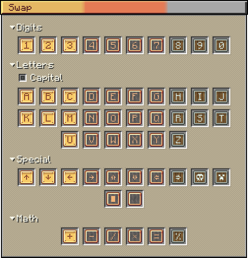
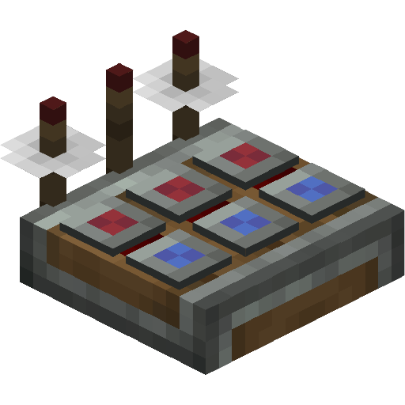

 

	
	
	

***Frequency Create*** is a quality-of-life addon for the Create mod that adds a set of symbol items for configuring Redstone Link frequencies.

This mod adds **3 sets of 78 symbols** each:
- **10 Digit Symbols**
- **52 Letter Symbols**
- **8 Arrow Symbols**
- **2 Custom Symbols**
- **Symbol for Fluid**
- **Empty Symbol**

---

RMB with a symbol opens a GUI to change it:

---

**Logic Combinator**
Allows performing logical operations with signals and outputting the result on another frequency.

Found a ***bug*** or have a ***suggestion***? Please [open an issue](https://github.com/MaliceZed/frequency-create/issues)!