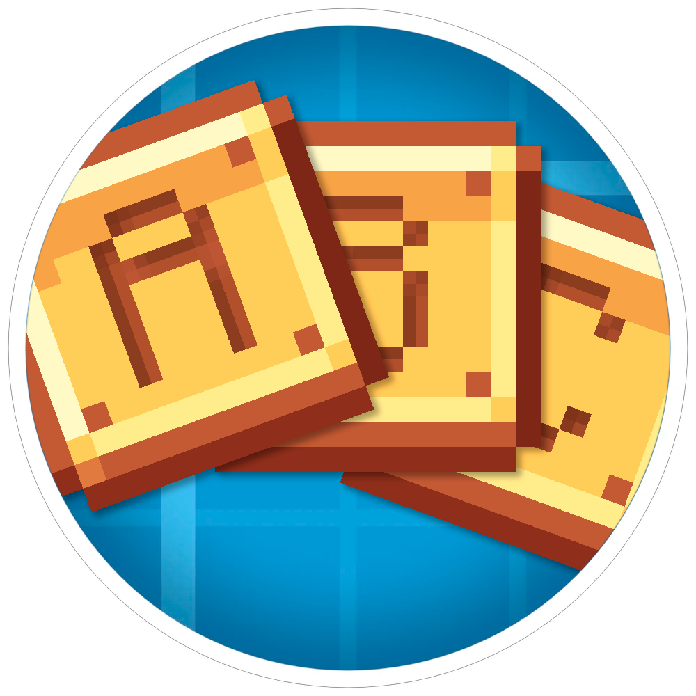

<h1 align="center">Frequency for Create 

## 📖 Overview

Frequency for Create is a quality-of-life addon for the Create mod that adds a set of symbol items for configuring Redstone Link frequencies.

## ✨ Features

### 🔢 Complete Symbol Set
- **10 Digit Symbols** (0-9) - For numeric frequencies
- **26 Letter Symbols** (A-Z) - For alphabetic frequencies  
- **8 Arrow Symbols** (↑↓←→) - For directional indicators
- **1 Empty Symbol** - For clearing frequency slots

### 🎨 Intuitive GUI
Right-click any symbol item to open an elegant swap interface where you can:
- Browse all available symbols organized by category
- Instantly swap your held symbol with any other
- See clear visual categories: Digits, Letters, Symbols

## 🎮 How to Use

1. Craft empty symbol item
2. Right-click symbol to open the swap GUI
3. Click on any symbol to swap your current item
4. Use symbols to configure your Redstone Link frequencies

## 📞 Support

Found a bug or have a suggestion? Please [open an issue](https://github.com/MaliceZed/frequency-create/issues)!

---

*Simplify your Create contraptions with Frequency for Create!*
